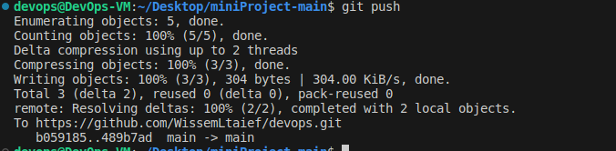

### Yellow Pages App - DevOps Project Documentation

## Overview


This project demonstrates a comprehensive DevOps pipeline for a Yellow Pages application, utilizing technologies such as Docker, Jenkins CI/CD, unit testing, and Kubernetes deployment. The application consists of a Node.js backend and a React.js frontend.

## Architecture

The application is structured into two primary components:

Backend: Built with Node.js, handling the application logic and database interactions.
Frontend: Developed with React.js, providing a user-friendly interface for browsing and interacting with the Yellow Pages data.

## Dockerization

# Backend Dockerfile

```
Dockerfile

FROM node:18-alpine

WORKDIR /usr/src/app 

COPY package*.json ./ 

RUN npm install

COPY . . 

EXPOSE 3001

CMD [ "node", "index.js" ]
```
# Frontend Dockerfile
```
Dockerfile

FROM node:18-alpine as build 

WORKDIR /usr/src/app 

COPY package*.json ./ 

RUN npm install 

COPY . .

RUN npm run build 

FROM nginx:alpine

COPY --from=build /usr/src/app/build /usr/share/nginx/html 

EXPOSE 80

```


## Jenkins Pipeline

Pipeline Stages

Checkout: Clones the code. 
Build Backend & Frontend: Constructs Docker images. 
Unit Tests: Placeholder for unit tests. 
Push to Docker Registry: Uploads images to Docker Hub.

```
pipeline {
    agent any

    environment {
        DOCKER_IMAGE_BACKEND  = "wissemletaief/myapp-backend:latest"
        DOCKER_IMAGE_FRONTEND = "wissemletaief/myapp-frontend:latest"
    }

    stages {
        stage('Checkout') {
            steps {
                // Get the latest code from your source control
                checkout scm
            }
        }

        stage('Build Backend') {
            steps {
                script {
                    dir('server') {
                        sh 'ls -la' // Lists all files in the server directory
                        sh 'docker build -t wissemletaief/myapp-backend .'
                    }
                }
            }
        }


        stage('Build Frontend') {
            steps {
                script {
                    dir('client') {
                        sh 'ls -la' // Lists all files in the server directory
                        sh 'docker build -t wissemletaief/myapp-frontend .'
                    }
                }
            }
        }


        stage('Unit Tests') {
            steps {
                // script {
                //     dir('client') {
                //        sh 'ls -la' // Lists all files in the server directory
                //        sh 'npm test'
                //     }
                // }

                //script {
                //    dir('server') {
                //       sh 'npm install'
                //       sh 'npm test'
                //    }
                //}

                sh 'echo "Unit tests passed"'
            }
        }


        stage('Push to Registry') {
            steps {
                script {
                    // Login to Docker Hub and push the images
                    docker.withRegistry('https://registry.hub.docker.com', 'wissemletaief') {
                        docker.image("${DOCKER_IMAGE_BACKEND}").push()
                        docker.image("${DOCKER_IMAGE_FRONTEND}").push()
                    }
                }
            }
        }
 
    }

    post {
        always {
            echo 'Performing some actions '
        }
    }
}
```
## Kubernetes Deployment


Deployment Process

Applying Kubernetes Configurations: 

Use kubectl apply -f <file.yaml> for both backend and frontend deployment YAML files.

Service Exposure: Apply the service.yaml to create services exposing the deployments.


Cleanup
To remove the deployed services:

```
kubectl delete -f backend-deployment.yaml kubectl delete -f frontend-deployment.yaml kubectl delete -f service.yaml
```
## Conclusion
This project illustrates a complete CI/CD pipeline using Jenkins, Docker, and Kubernetes for a Yellow Pages application, showcasing modern DevOps practices for Node.js and React.js applications.


